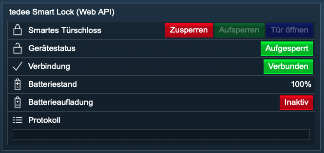
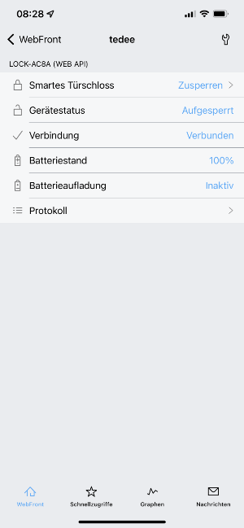

[](https://tedee.com)

### Smart Lock Web API

Dieses Modul integriert dein tedee Smart Lock.  

Für dieses Modul besteht kein Anspruch auf Fehlerfreiheit, Weiterentwicklung, sonstige Unterstützung oder Support.  
Bevor das Modul installiert wird, sollte unbedingt ein Backup von IP-Symcon durchgeführt werden.  
Der Entwickler haftet nicht für eventuell auftretende Datenverluste oder sonstige Schäden.  
Der Nutzer stimmt den o.a. Bedingungen, sowie den Lizenzbedingungen ausdrücklich zu.


### Inhaltsverzeichnis

1. [Funktionsumfang](#1-funktionsumfang)
2. [Voraussetzungen](#2-voraussetzungen)
3. [Software-Installation](#3-software-installation)
4. [Einrichten der Instanzen in IP-Symcon](#4-einrichten-der-instanzen-in-ip-symcon)
5. [Statusvariablen und Profile](#5-statusvariablen-und-profile)
6. [WebFront](#6-webfront)
7. [PHP-Befehlsreferenz](#7-php-befehlsreferenz)

### 1. Funktionsumfang

* Schloss zu- und aufsperren inkl. weiterer Funktionen
* Gerätestatus anzeigen (diverse)
* Protokoll anzeigen

### 2. Voraussetzungen

- IP-Symcon ab Version 6.0
- tedee Smart Lock
- tedee Bridge
- Persönlicher Zugangsschlüssel (PAK)
- Internetverbindung

### 3. Software-Installation

* Bei kommerzieller Nutzung (z.B. als Einrichter oder Integrator) wenden Sie sich bitte zunächst an den Autor.
* Über den Module Store das `tedee` Modul installieren.

### 4. Einrichten der Instanzen in IP-Symcon

- In IP-Symcon an beliebiger Stelle `Instanz hinzufügen` auswählen und `Tedee Smart Lock Web API` auswählen, welches unter dem Hersteller `tedee` aufgeführt ist.
- Es wird eine neue `Tedee Smart Lock Web API` Instanz angelegt.
- Weitere Informationen zum Hinzufügen von Instanzen finden Sie in der [Dokumentation der Instanzen](https://www.symcon.de/service/dokumentation/konzepte/instanzen/#Instanz_hinzufügen)

__Konfigurationsseite__:

Name                                    | Beschreibung
--------------------------------------- | --------------------------------------------
Geräte ID                               | ID des Gerätes
Seriennummer                            | Seriennummer des Gerätes  
Name                                    | Name des Gerätes
Aktualisierungsintervall                | Aktualisieurngsinterval für den Gerätestaus
Protokoll                               | Protokoll de- / aktivieren
Anzahl der maximalen Protokolleinträge  | Anzahl der Protokolleinträge
Tägliches Zusperren                     | Tägliches Zusperren de- / aktivieren
Zusperren um                            | Uhrzeit
Tägliches Aufsperren                    | Tägliches Aufsperren de- / aktivieren
Aufsperren um                           | Uhrzeit

### 5. Statusvariablen und Profile

Die Statusvariablen/Kategorien werden automatisch angelegt.  
Das Löschen einzelner kann zu Fehlfunktionen führen.

#### Statusvariablen

Name            | Typ       | Beschreibung
--------------- | --------- | -------------------------
SmartLock       | integer   | Zu- / Aufspeeren / Öffnen
DeviceState     | integer   | Gerätestatus
Connection      | boolean   | Verbindung zur Bridge
BatteryLevel    | integer   | Batteriestand
BatteryCharging | boolean   | Batterieaufladung
ActivityLog     | Protokoll | Protokoll

#### Profile

TEDEESLW.InstanzID.Name

Name                    | Typ
----------------------- | -------
SmartLock               | integer
DeviceState             | integer
Connection              | boolean
BatteryLevel            | integer
BatteryCharging         | boolean

Wird die Instanz gelöscht, so werden automatisch die oben aufgeführten Profile gelöscht.

### 6. WebFront

Die Funktionalität, die das Modul im WebFront bietet.

* Schloss zu- und aufsperren inkl. weiterer Funktionen
* Gerätestatus anzeigen (diverse)
* Protokoll anzeigen

[]()

[]()

### 7. PHP-Befehlsreferenz

```text
Smart Lock Aktionen (Zu- und aufsperren + weitere Aktionen)

TEDEESLW_SetLockAction(integer $InstanzID, integer $Aktion);

Schaltet eine bestimmte Aktion des Smart Locks.  
Liefert als Rückgabewert einen json kodierten String mit dem Ergebnis.

$Aktion:
0   =   Zusperren
1   =   Aufsperren
2   =   Tür öffnen

Beispiel:

//Zusperren
$action = TEDEESLW_SetSmartLockAction(12345, 0);
//Rückgabewert
print_r(json_decode($action, true));
```

```text
Gerätestatus aktualisieren

TEDEESLW_ UpdateDeviceData(integer $InstanzID);

Fragt den aktuellen Status des Gerätes ab und aktualisiert die Werte der entsprechenden Variablen. 
Liefert keinen Rückgabewert.

Beispiel:

TEDEESLW_UpdateDeviceData(12345);
```